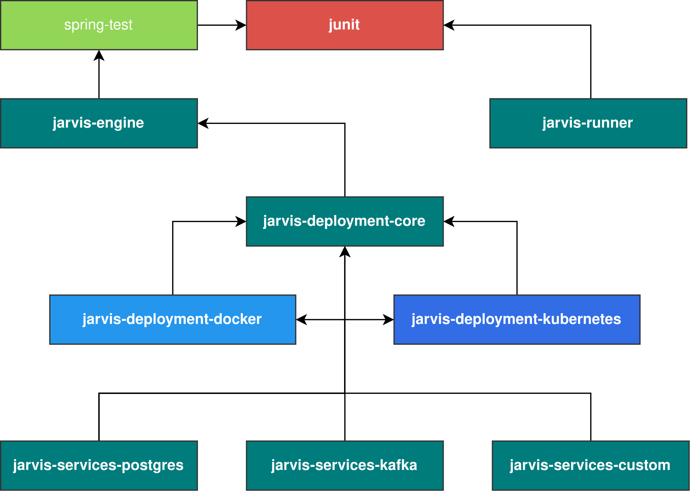

# Introduction

Jarvis is an **annotation driven** end-to-end (e2e) **test runner** that leverages the robustness of the Spring Test Framework
and JUnit. It offers seamless integration with Docker and Kubernetes, making it easy to deploy internal
or third party services needed during e2e testing.

# Getting Started

To kickstart your journey with Jarvis, simply include the
following [dependency](https://dev.azure.com/gourban/Core/_artifacts/feed/backend/maven/com.github.markostijak.jarvis.engine%2Fjarvis-engine/overview/0.0.1.49242-PR_10639) in your project:

```
testImplementation group: 'com.github.markostijak.jarvis.engine', name: 'jarvis-engine', version: '0.0.1.xxxxx-main'
```

As Jarvis depends on the Spring Test Framework, it is important to include
the `spring-test` [dependency](https://mvnrepository.com/artifact/org.springframework.boot/spring-boot-starter-test)
in your project. This can be achieved by adding the following lines to your `gradle.build` file:

```
testImplementation group: 'org.springframework.boot', name: 'spring-boot-starter-test', version: '3.1.0'
```

By including this dependency, you ensure that your project has access to the necessary components
for seamless collaboration between Jarvis and the Spring Test Framework.

Once Jarvis is on your classpath, use `@JarvisTest` annotation to enable Jarvis in your tests, as shown bellow.
It will also enable Spring DI and autoconfiguration in your tests. Keep reading to see more details about Jarvis.

```
@JarvisTest
public class ExampleTest {

    @Autowired
    private RemoteService service;

    @Test
    void example() {
        System.out.println(service.sayHello("Hello from Jarvis!"));
    }

}
```

# Overview

At the heart of Jarvis lies the `jarvis-engine` module, which seamlessly integrates with
both the Spring Test and JUnit frameworks. This module serves as the foundation for Jarvis' s
functionality.

Building upon the `jarvis-engine` module, the `jarvis-deployment-core` module extends its capabilities
by enabling the deployment of services as Docker containers through the `jarvis-deployment-docker`
component. Additionally, it provides the ability to deploy services as Kubernetes resources using
the `jarvis-deployment-kubernetes` component. This expansion enhances Jarvis's versatility and
empowers users to deploy internal or third party services in containerized environments with ease.
You can find [here](modules/deployment/README.md) more details about this Jarvis extension.

Furthermore, the `jarvis-runner` module facilitates the execution of tests in various environments.
It enables running tests directly from the JAR file, which can then be run as Docker container,
or as a Kubernetes job.

The Jarvis architecture overview is shown on image bellow:

<p align="center">
  
    <br><br>
  Figure 1.1 Jarvis architecture
</p>

## Jarvis engine

As stated before, `jarvis-engine` is heart of Jarvis framework. It integrates with Spring Test Context
and provides `JarvisLifecycleListener` interface for further extensions and integrations. During a
bootstrap process, Jarvis will create two contexts:

- Jarvis Context (`JarvisContext.java`)
    - parent jvm scoped context
- Jarvis Test Context (`JarvisTestContext.java`)
    - child test-class scoped context

In listeners implementing the `JarvisLifecycleListener`, the `JarvisContext` and `JarvisTestContext`
will be provided out of the box, as a method parameters.

In listeners implementing the Spring's `TestExecutionListener`, you can also obtain the `JarvisContext`
and `JarvisTestContext` from `TestContext` by using the static `JarvisUtils.getJarvisContext(testContext)` or
`JarvisUtils.getJarvisTestContext(testContext)` utility class/methods.

You can also use `JarvisContext` and `JarvisTestContext` to store attributes between different scopes of execution.

### Jarvis Context

The parent `JarvisContext` serves as a singleton context within Jarvis. It means that its
lifecycle is tied to the lifecycle of the JVM, ensuring that it lives throughout the entire
duration of the testing process. The attributes stored within this context are shared across
all test classes, allowing for centralized configuration and sharing of resources. The primary
purpose of the `JarvisContext` is to facilitate the internal components and extensions of Jarvis
needed during the whole testing process.

### Jarvis Test Context

The child `JarvisTestContext` is a test-class scoped context within Jarvis. Its lifecycle is
specific to each individual test class, meaning that it is created when the test class is instantiated
and destroyed once the test class has completed its execution. That means there will be more of them at once
in parallel execution.

The purpose of the `JarvisTestContext` is to provide a dedicated context for each test class,
ensuring isolation and independence between different tests. By having a separate context for
each test class, any changes or modifications made within the context of one test class do not
affect the context or state of other test classes.

---

### Components

As Jarvis is loaded before Spring application context, the only way to register additional Jarvis
components is by using `JarvisLifecycleListener`s and storing them as attributes in `JarvisContext`.

However, in tests, beans are available, and you can use Spring autoconfiguration feature.
Autoconfiguration in Spring Boot automatically configures various components based on classpath
and other conditions. See [this](https://docs.spring.io/spring-boot/docs/2.0.x/reference/html/using-boot-auto-configuration.html)
and [this](https://www.baeldung.com/spring-boot-custom-auto-configuration) for more details.

If `@JarvisTest` is used on test class, `@EnableAutoConfiguration` is disabled by default, and needs to be
explicitly enabled using the `spring.boot.enableautoconfiguration` property (`false by` default). It is
recommended to use Jarvis own mechanisms for component registration in this case, which is very similar to the
`@EnableAutoConfiguration` way, by using `@ImportComponents` annotation. This will prevent loading of spring
autoconfigured beans from included starter dependencies.

If one of Spring's own annotations are used, like `@SpringBootTest`, the `@EnableAutoConfiguration` will work out of the box,
as it would in regular Spring boot tests.

---

### Listeners

When creating additional listeners by implementing `JarvisLifecycleListener` interface, you will
need to register them by using `spring.factories` file. These listeners need to be loaded before
Spring context is initialized, and this is the only way to load them before other beans.

It is crucial to pay attention to the order of their execution. The order can significantly
impact the behavior and outcome of the Jarvis execution. The listener order is specified by using `@Order(n)` annotation,
or by implementing `Ordered` interface. In Jarvis, there are special rules regarding the order of listeners:

- For the `before***` methods, the specified order will be honored during execution.
  You can assign a specific order to the listeners to ensure they are executed in the
  desired sequence. This allows you to control the setup and preparation steps before
  the tests are executed.
    - In case when some listener fails, the rest `before***` callbacks won't be executed.

- On the other hand, for the `after***` methods, the listeners are executed in reverse order.
  This behavior ensures that cleanup and teardown operations are performed in correlation with their setup.
    - In case when some listener fails, the rest `after***` callbacks will still be executed.

On the other hand, Spring's `TestExecutionListener`s are loaded after Spring context is refreshed. This means
you can register them as a `beans`, and they will be picked up by Jarvis and executed by following the same ordering
rules as `JarvisLifecycleListener`s.

### Properties

Jarvis, being built on Spring, fully supports Spring-style externalized configuration using
`.yaml` property files and profiles. It also provides flexibility in naming the property files.
These are all valid examples of property file names that Jarvis supports:

- application.yml
- properties.yml
- jarvis.yml

---

### See more:

- See here how to use [jarvis-deployment](modules/deployment/README.md)
- See here how to add custom [jarvis-services](services/README.md)
